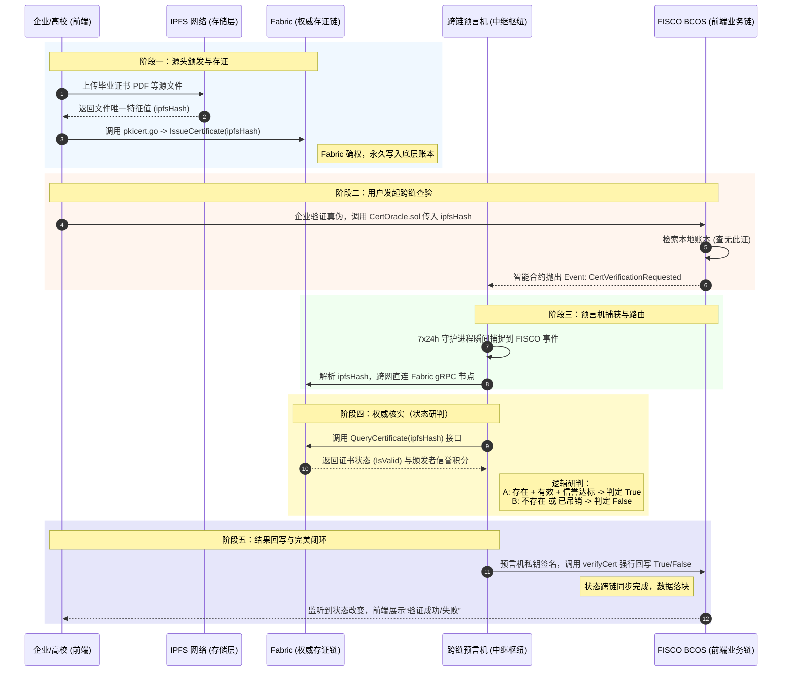

# 🏛️ 异构双链跨链系统 - 核心架构与战略路线图

本仓库不仅是跨链预言机的代码库，更是整个《异构双链跨链存证系统》的战略大本营。本文档完整记录了系统的角色定义、5步流转全景，以及正在攻克的演进目标。

---

## 🎭 一、 角色定义（三位一体 + 物理层）

我们的架构由四个核心组件完美咬合：

1. **后端权威大本营 (Hyperledger Fabric)**
   - **职责**：运行 `pkicert.go` 和 `spbft.go`。只有信誉积分达标的节点，才有资格在这里颁发证书。
   - **特性**：数据绝对权威、隐私保护极高。
2. **前端高频业务链 (FISCO BCOS)**
   - **职责**：运行 `CertOracle.sol`。面对海量用户的查询请求。
   - **特性**：出块极快，适合作为业务流转的前端缓冲层。
3. **跨链枢纽中间件 (Go 预言机 / Chainlink)**
   - **职责**：7x24 小时运行，负责跨网络的数据搬运和密码学签名。
4. **物理存储层 (IPFS)**
   - **职责**：存储真实的证书文件（如 PDF、图片），仅将文件的特征值（哈希）上链，确保链上数据轻量化。

---

## 🔄 二、 全景数据流转 5 步曲

这是系统最核心的生命线，目前 MVP 版本已在物理层面上打通：

### 阶段一：源头颁发与存证（数据录入）
* **IPFS 文件上链**：某高校（Fabric 里的 Org1）生成毕业证书 PDF，上传至 IPFS，获得全球唯一指纹：`ipfsHash`（如 Qm...123）。
* **Fabric 权威铸造**：Org1 调用 Fabric 上的 `pkicert.go` 的 `IssueCertificate` 方法，将 `ipfsHash` 永久写入账本。Fabric 拥有唯一合法解释权。

### 阶段二：用户发起跨链查验（业务触发）
* **FISCO 侧查询**：企业拿到应聘者的证书哈希，通过网页调用 FISCO BCOS 的 `CertOracle.sol` 验证接口。
* **抛出跨链事件**：FISCO 账本查无此数据，智能合约抛出 Event（`CertVerificationRequested(ipfsHash)`），向外部预言机求助。

### 阶段三：预言机捕获与路由（核心中继）
* **精确监听**：挂在后台的预言机（Go 原生或 Chainlink 节点）瞬间捕捉到 FISCO 抛出的 Event。
* **跨网提取**：预言机解析出目标 `ipfsHash`，转身使用 Fabric SDK 连接服务链。

### 阶段四：权威核实（状态研判）
* **调用 Fabric**：预言机调用 Fabric 的 `QueryCertificate(ipfsHash)` 接口。
* **状态判定**：
  * **[情况 A - 有效]**：证书存在且 `IsValid == true`，且颁发者 S-PBFT 信誉正常 ➡️ 判定 `True`。
  * **[情况 B - 无效]**：查无此证，或已吊销 ➡️ 判定 `False`。

### 阶段五：结果回写与完美闭环（共识落定）
* **预言机签名回写**：预言机用私钥签名，调用 FISCO BCOS 的 `verifyCert` 方法，将 `True/False` 强行写回账本。
* **前端状态更新**：企业网页监听到 FISCO 状态变化，弹出真实性验证结果。

---

## 🗺️ 三、 终极演进路线图 (Checklist)
```mermaid
sequenceDiagram
    autonumber
    
    %% 定义参与角色
    participant Web as Web大屏 (全栈前端)
    participant FISCO as FISCO BCOS (业务侧链)
    participant Listener as 智能哨兵 (auto_trigger)
    participant Chainlink as Chainlink (核心预言机)
    participant Adapter as 穿透适配器 (8081端口)
    participant Fabric as Fabric (底层权威账本)
    participant Writer as 回写中枢 (8082端口)

    %% 阶段一
    rect rgb(240, 248, 255)
    Note over Web, FISCO: 阶段一：指纹提取与跨链发车
    Web->>Web: 用户拖拽文件，WebCrypto 瞬间计算 SHA-256 指纹
    Web->>FISCO: 调用 requestVerification(hash) 发起上链
    Note right of FISCO: 将动态明文哈希转为底层 ABI Hex 数据
    FISCO-->>Listener: 账本落块，抛出底层交易事件
    end

    %% 阶段二
    rect rgb(255, 245, 238)
    Note over FISCO, Chainlink: 阶段二：智能拦截与防套娃解析
    Listener->>Listener: 轮询区块，抓取目标合约的 Input Data
    Note right of Listener: 🛡️ 核心黑科技：<br/>1. 长度过滤 (防无限死循环套娃)<br/>2. 极客 ABI 解码 (从 Hex 剥离出真指纹)
    Listener->>Chainlink: 模拟登录获取 Session Cookie
    Listener->>Chainlink: 触发 Webhook，精准投递跨链任务
    end

    %% 阶段三
    rect rgb(240, 255, 240)
    Note over Chainlink, Fabric: 阶段三：预言机路由与物理穿透
    Chainlink->>Chainlink: 启动 TOML 流水线 (防崩溃转义处理)
    Chainlink->>Adapter: 发起 Bridge 请求，转发目标哈希
    Adapter->>Fabric: 动用宿主机 os/exec 权限，调用 peer query
    Note right of Adapter: 绕过繁琐 SDK，一针见血直击 Fabric 链码深层状态
    Fabric-->>Adapter: 返回确权结果 (查无此证/存在有效)
    Adapter-->>Chainlink: 组装 JSON 结果 (包含 isValid 与原始单号)
    end

    %% 阶段四
    rect rgb(255, 250, 205)
    Note over Chainlink, Writer: 阶段四：跨链回调与防注入护盾
    Chainlink->>Writer: 携带 Token 将最终判决打向 8082 中枢
    Writer->>Writer: 校验 Token，组装底层 bash 命令
    Note right of Writer: 🛡️ 核心黑科技：<br/>参数级严格隔离与双引号拼接，彻底封杀 OS 命令注入漏洞！
    Writer->>FISCO: 唤醒控制台，调用 fulfillVerification 回写
    Note left of FISCO: 状态跨链同步完成，不可篡改的铁证落块！
    end

    %% 阶段五
    rect rgb(230, 230, 250)
    Note over Web, FISCO: 阶段五：大满贯查证与完美闭环
    Web->>FISCO: 用户点击查证，调用 getResult(hash)
    FISCO-->>Web: 返回真实确权状态 (True/False)
    Web->>Web: 前端赛博风 UI 渲染：核验通过 / 核验驳回
    end
根据最初的项目规划，我们将逐步点亮以下科技树：

- [x] **1) Hyper Fabric 联盟链搭建**
- [x] **2) FISCO BCOS 联盟链搭建**
- [x] **3) 支持不同共识算法 (PBFT, DPoS, Raft/Kafka)**
- [x] **4) 智能合约应用 (已双端部署)**
- [ ] **5) 区块链浏览器可视化接入**
- [ ] **6) 预言机多形态演进：**
  - [x] 6.b) 链上数据获取 
  - [x] 6.c) 中心化预言机 (当前的 Go API/守护进程版)
  - [x] 6.d) 预言机 + IPFS 综合验证
  - [ ] **6.a) Chainlink 去中心化预言机实验 (下一步核心突破点)**
